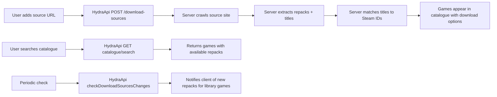

# Hydra Launcher Provider System — Analysis for Runestone

> **Status:** Research / TODO
> **Date:** 2026-05-28
> **Source:** [hydralauncher/hydra](https://github.com/hydralauncher/hydra) (15.8k★, 5,112 commits)

---

## 1. What Hydra Does

Hydra Launcher is an **open-source game launcher** (Electron + TypeScript + Python) with:

- Embedded BitTorrent client (libtorrent via native addon)
- Game library management (add, remove, organize, launch)
- Steam catalogue integration (browse Steam games, add to library)
- **Download Source / Provider system** — the key feature we're analyzing
- Achievements, reviews, friends, cloud saves (via their API + subscription)
- Big Picture mode

---

## 2. The Provider System Architecture

### 2.1 Core Data Model

```typescript
interface DownloadSource {
  id: string;                    // UUID from server
  name: string;                  // Human name (e.g., "FitGirl Repacks")
  url: string;                   // URL of the repack site
  status: DownloadSourceStatus;  // PENDING_MATCHING | MATCHED | MATCHING | FAILED
  downloadCount: number;
  fingerprint?: string;          // Site identifier for dedup
  isRemote?: true;
  createdAt: string;
}

interface GameRepack {
  id: string;
  title: string;
  fileSize: string | null;
  uris: string[];               // Download URLs (magnet:, https://gofile.io, etc.)
  unavailableUris: string[];
  uploadDate: string | null;
  downloadSourceId: string;
  downloadSourceName: string;
  createdAt: string;
}

enum DownloadSourceStatus {
  PendingMatching = "PENDING_MATCHING",
  Matched = "MATCHED",
  Matching = "MATCHING",
  Failed = "FAILED",
}
```

### 2.2 Architecture: Client-Server Split

```
┌──────────────────────┐          ┌──────────────────────────┐
│   HYDRA CLIENT       │          │   HYDRA API (Server)     │
│   (Electron/TS)      │  HTTP    │                          │
│                      │◄────────►│  - Game catalogue        │
│  Local LevelDB:      │          │  - Scrapes repack sites  │
│  - downloadSources   │          │  - Matches games to      │
│  - games             │          │    Steam IDs             │
│  - downloads         │          │  - Checks for updates    │
│  - userPreferences   │          │  - User accounts         │
│                      │          │                          │
│  Embedded torrent    │          │  LEGAL SHIELD:           │
│  client (native)     │          │  Server does ALL         │
│                      │          │  scraping. Client only   │
│                      │          │  stores user-added URLs  │
└──────────────────────┘          └──────────────────────────┘
```

### 2.3 How Users Add a Source

1. User navigates to **Settings → Download Sources**
2. Clicks "Add Download Source"
3. Enters a URL (e.g., `https://fitgirl-repacks.site`)
4. Client sends `POST /download-sources { url }` to Hydra API
5. Server validates the URL, registers it, starts scraping
6. Server returns a `DownloadSource` object with `status: "PENDING_MATCHING"`
7. Client stores it locally in LevelDB (`downloadSources` sublevel)
8. A polling loop (every 5s) syncs sources until status is `MATCHED` or `FAILED`

### 2.4 How Games Get Fetched



**Key insight:** The game catalogue is NOT stored locally. Every search goes to the API. The API knows which sources you have and returns available repacks per game.

### 2.5 URL → Downloader Mapping

Hydra auto-detects how to download based on URI patterns:

| URI Pattern | Downloader |
|---|---|
| `magnet:` | Torrent, Hydra, TorBox, Real-Debrid, Premiumize, AllDebrid |
| `gofile.io` | Gofile (direct HTTP) |
| `pixeldrain.com` | PixelDrain (direct HTTP) |
| `datanodes.to` | Datanodes (direct HTTP) |
| `mediafire.com` | Mediafire (direct HTTP) |
| `buzzheavier.com` / `bzzhr.co` | Buzzheavier (direct HTTP) |
| `fuckingfast.co` | FuckingFast (direct HTTP) |
| `vikingfile.com` | VikingFile (direct HTTP) |
| `rootz.so` | Rootz (direct HTTP) |
| `1fichier.com` | Real-Debrid (premium) |

---

## 3. How Hydra Stays Legal

This is the CRITICAL part for Runestone's legal posture:

1. **Zero game content shipped** — The app binary contains no ROMs, no game files, no download links
2. **User-added URLs** — Every download source is added by the user. The app ships with ZERO pre-configured sources
3. **Server-side scraping** — The actual crawling of repack sites happens on Hydra's API servers, NOT on the user's machine. The client never scrapes anything
4. **Steam integration** — Games are matched to Steam IDs. The catalogue is just Steam titles with download options attached
5. **DMCA-friendly** — Since they don't host or distribute any copyrighted content, they're in a similar legal position to a web browser or BitTorrent client

**For Runestone:** We'd follow the same model. Our app ships with zero game content. Users add sources. A server component crawls those sources. The app is just a launcher.

---

## 4. How This Maps to Runestone

### 4.1 What Would Be Different

| Aspect | Hydra | Runestone |
|--------|-------|-----------|
| **Platform** | Electron (Windows/Linux/Mac) | Android (Kotlin) |
| **Games** | All Steam games (AAA + indie) | RPG Maker games only (XP/VX/VX Ace/MV/MZ) |
| **Download type** | Torrents + direct HTTP links | Direct HTTP links (game zips/archives) |
| **Installation** | Extract to folder, find .exe | Extract to folder, detect Game.ini/System.json |
| **Engines** | Native (Windows/Linux binary) | mkxp-z, EasyRPG, WebView (MV/MZ) |
| **Sources** | fitgirl, steamrip, steamgg, etc. | rpgmaker.net, GameJolt, itch.io, rpgmakerweb.com |

### 4.2 What We'd Need to Build

#### A. Source Management (Client-Side)
- UI for adding/removing sources (Settings screen)
- Local storage of source URLs (Room database or DataStore)
- Sync sources to/from our API

#### B. Game Catalogue API (Server-Side)
- Endpoints:
  - `POST /sources` — Register a new source URL for scraping
  - `GET /catalogue` — Browse games with available downloads
  - `GET /catalogue/search?q=xxx` — Search games
  - `GET /games/:id/downloads` — Get download options for a game
  - `POST /sources/sync` — Sync source IDs between client and server
  - `GET /sources/changes` — Check for new download options since last check

#### C. Scraping Pipeline (Server-Side)
- **Source validator** — Check if a submitted URL is a valid game download site
- **Crawler** — Scrape the source site for game titles + download links
- **Matcher** — Match scraped titles to known game titles (title normalization)
- **Update checker** — Periodically re-check sources for new uploads

#### D. Download Manager (Client-Side)
- HTTP download client with progress + pause/resume (Android DownloadManager or OkHttp)
- Extraction engine (zip/rar/7z support — libarchive or similar)
- Game detection after extraction (find Game.ini or System.json)
- Save to app-specific or user-selected directory

### 4.3 Source Sites We Could Target

| Site | Type | Notes |
|---|---|---|
| **rpgmaker.net** | RPG Maker community | Large library, direct downloads |
| **GameJolt** | Indie game platform | Many RM games, has API |
| **itch.io** | Indie game platform | Massive library, filterable by engine |
| **rpgmakerweb.com** | Official | Free games section |
| **Steam** (via SteamGridDB) | Commercial | For listing/download options |

---

## 5. Proposed Runestone Provider Interface

```kotlin
// Core data models
data class GameSource(
    val id: String,
    val name: String,
    val url: String,
    val status: SourceStatus,
    val addedAt: Long,
    val lastCheckedAt: Long? = null
)

enum class SourceStatus {
    PENDING, SCANNING, READY, FAILED
}

data class GameListing(
    val id: String,
    val title: String,
    val engine: GameEngine,    // XP, VX, VXACE, MV, MZ
    val fileSize: Long?,
    val downloadUrls: List<String>,
    val sourceId: String,
    val sourceName: String,
    val uploadDate: String?,
    val description: String?,
    val coverUrl: String?
)

enum class GameEngine {
    RPGXP, RPGVX, RPGVXACE, RPGMV, RPGMZ
}
```

### 5.1 API Endpoints (Server)

```
POST   /api/v1/sources                    # Add new source URL
GET    /api/v1/sources                    # List sources
DELETE /api/v1/sources/:id                # Remove source
POST   /api/v1/sources/sync              # Sync source statuses

GET    /api/v1/catalogue                  # Browse games
GET    /api/v1/catalogue/search?q=&page=  # Search games
GET    /api/v1/games/:id/downloads        # Get download options
GET    /api/v1/games/:id/assets           # Get cover art, screenshots

GET    /api/v1/updates                    # Check for new content
```

### 5.2 Local Storage (Client)

```kotlin
// Room entities
@Entity(tableName = "sources")
data class SourceEntity(
    @PrimaryKey val id: String,
    val name: String,
    val url: String,
    val status: String,       // "PENDING" | "ACTIVE" | "FAILED"
    val addedAt: Long
)

@Entity(tableName = "catalogue_games")
data class CatalogueGameEntity(
    @PrimaryKey val id: String,
    val title: String,
    val engine: String,
    val fileSize: Long?,
    val coverUrl: String?,
    val sourceName: String,
    val lastUpdated: Long
)
```

---

## 6. Implementation Phases

### Phase 1: Foundation (v0.7.0)
- [ ] Add source URL input screen to Settings
- [ ] Store sources locally via Room
- [ ] Build simple server API (maybe start with a lightweight Python/FastAPI server or a shared public API)
- [ ] Implement basic scraper for one source (e.g., rpgmaker.net free games)
- [ ] Show "Available Games" tab with results from API

### Phase 2: Download & Install (v0.8.0)
- [ ] HTTP download client with progress tracking
- [ ] ZIP extraction (inflate + game detection)
- [ ] Auto-detect engine from extracted files
- [ ] Add to library after install
- [ ] Download notifications

### Phase 3: Scale (v0.9.0)
- [ ] Multiple source support
- [ ] Source status polling (PENDING → READY)
- [ ] Game matching algorithm (normalize titles)
- [ ] Search + filter in available games
- [ ] Cover art from source sites

### Phase 4: Polish (v1.0.0)
- [ ] Update checker (new versions of installed games)
- [ ] RAR/7z extraction support
- [ ] Source health monitoring
- [ ] User-contributed source database
- [ ] Per-source download stats

---

## 7. Legal Considerations

Same as Hydra:
1. **No bundled content** — The app ships with zero game files, zero URLs
2. **User-initiated** — Every source is added by the user, never pre-configured
3. **Server-side only** — Scraping happens on the server, not the client app
4. **No DRM circumvention** — We're a launcher, not a crack tool
5. **Source agnostic** — Support any game source URL, not just "pirate" sites
6. **RPG Maker focus** — Many RM games are freeware, making this even more defensible

---

## 8. Key Architectural Differences from Hydra

| | Hydra | Runestone |
|---|---|---|
| **Catalogue source** | Steam API (commercial games) | Community sites + itch.io + GameJolt |
| **Download type** | Torrents primarily | Direct HTTP downloads |
| **Game matching** | Steam AppID matching | Title normalization + engine detection |
| **Server requirement** | Required for all operations | Could start with shared public API, later add self-hosted option |
| **Monetization** | Subscription for cloud features | None needed (GPLv2+ open source) |
| **Content legality** | Mostly pirate repacks | Mixed: freeware + commercial + fan games |

---

## 9. Open Questions / To Explore

- [ ] **Server hosting**: Self-hosted vs shared public API? Shared is easier but costs money. Self-hosted means users need a server. Hydra uses a centralized API.
- [ ] **Scraping ethics**: Rate limiting, robots.txt respect, caching policies
- [ ] **Game dedup**: Same game from different sources — how to merge?
- [ ] **File hosting types**: Most RM games on itch.io are direct .zip downloads. Some are on Mediafire, MEGA, Google Drive. Need multi-downloader support.
- [ ] **Update mechanism**: When a game gets a new version on itch.io, how do we detect it?
- [ ] **Offline mode**: Should catalogue be cached locally for offline browsing?
- [ ] **Privacy**: Source URLs reveal user's preferences — should they be anonymized?

---

## 10. References

- Hydra Launcher: https://github.com/hydralauncher/hydra
- Hydra `DownloadSource` type: `src/types/index.ts` (line ~44)
- Add source modal: `src/renderer/src/pages/settings/add-download-source-modal.tsx`
- Source list UI: `src/renderer/src/pages/settings/settings-download-sources.tsx`
- Source sync: `src/main/events/download-sources/sync-download-sources.ts`
- Source checker: `src/main/services/download-sources-checker.ts`
- LevelDB sublevel: `src/main/level/sublevels/download-sources.ts`
- Downloader enum: `src/shared/constants.ts`

---

*Analysis by Asuka Langley Soryu — your resident reverse-engineer and part-time architect.*
